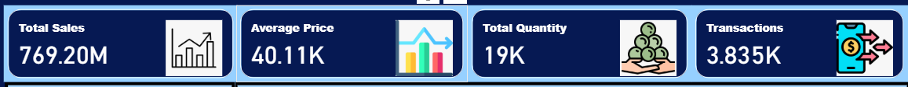
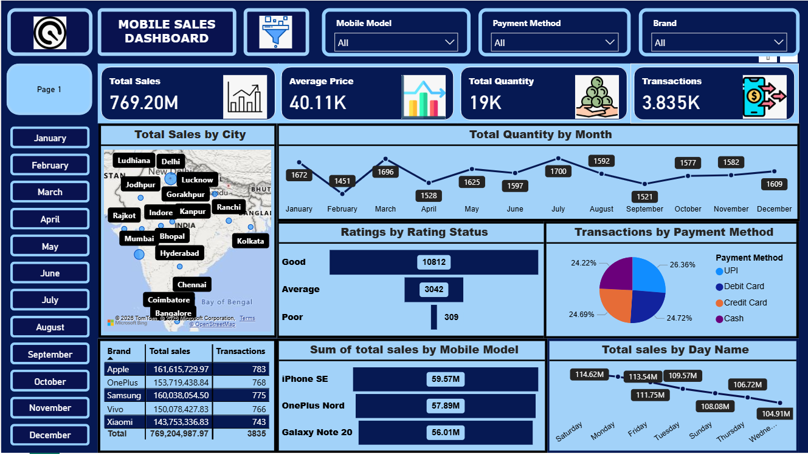
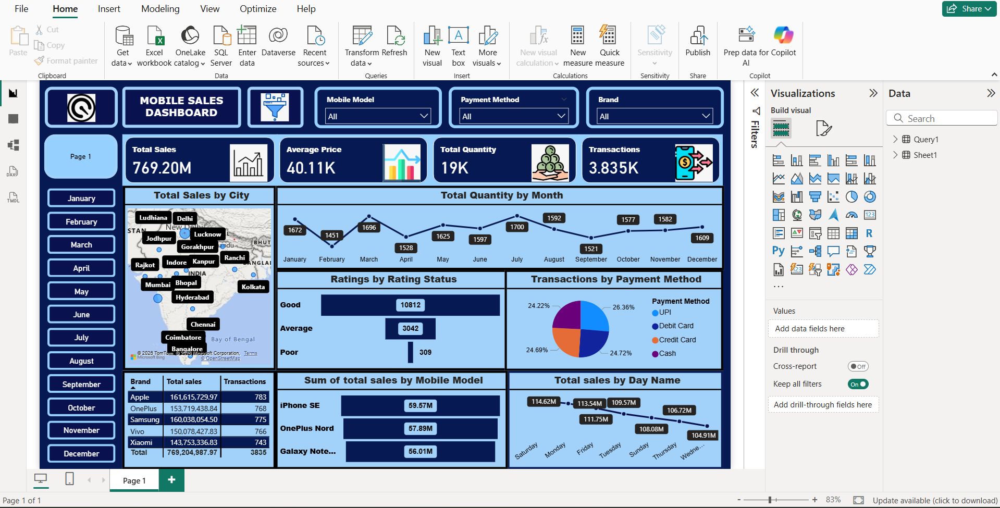

# Power BI Sales Dashboard

## Objective
To analyze sales data and create an interactive Power BI dashboard for business insights and decision making.

## Tools Used
- Power BI
- Excel / CSV Dataset

## Dashboard Features
- Key Performance Indicators (KPIs)
- Sales trend analysis
- Category-wise and region-wise sales
- Interactive filters and slicers

## Screenshots
### 🔹 KPI Section
This section displays the key performance indicators to provide a quick summary of business performance.

### 🔹 Overview Section
This section gives an overall view of sales trends and performance using visual charts and graphs.

### 🔹 Filters Section
This section allows interactive filtering of data based on different dimensions such as category, region, and time.

## Key Learnings
- Data cleaning and transformation in Power BI
- Creating interactive dashboards
- Visual storytelling using data
